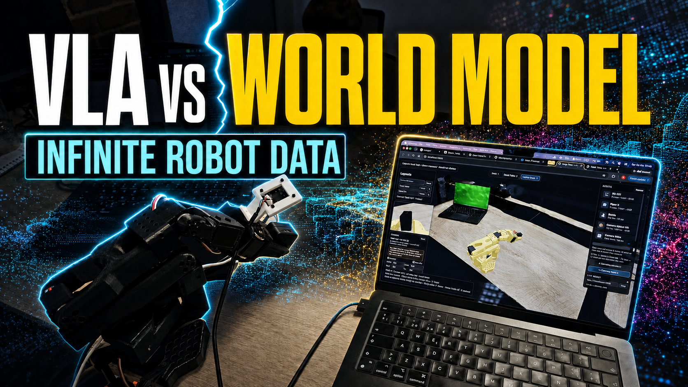

# Infinite Robot Data

**For the ChatGPT moment in robotics, we need data.**

ChatGPT had the whole internet to learn from. Robots have almost nothing — and every
existing way of getting robot data is broken in its own way:

- **CAD simulation** (Isaac Sim, MuJoCo with artist assets) looks nothing like the real
  world, so policies fall into the sim-to-real gap.
- **Real-world teleoperation** is slow, expensive, and every episode is welded to one
  environment, one robot, one camera rig.
- **Video-only world models** see everything and can touch nothing — no embodiment, no
  kinematic grounding, no actions.

Whether you're training **VLAs** or **world models**, the bottleneck is the same: there is
no internet of robot experience.

## The solution: an observation-first synthetic data engine

This repo uncouples **motion** from **environment** and from **embodiment**, so each one
can be multiplied independently:

> **One real trajectory + one phone video = thousands of hours of multi-robot training data.**

- **Infinite environments** — a raw `.mp4` walkthrough of any real place becomes a
  photoreal, walkable, collision-ready 3D scene (photogrammetry meshes, with Gaussian
  splat `.ply` support), entirely locally on a Mac.
- **Infinite embodiments** — the same live trajectory drives any URDF robot dropped into
  the scene: SO-101, Piper X, whatever you add next. Cross-embodiment retargeting maps
  one arm's motion onto another's kinematics in real time.
- **Infinite assets** — any object you can hold is captured on video and turned into a
  metric, physics-ready twin that exists simultaneously in the browser world and in a
  MuJoCo training scene.

A single human or robot trajectory, streamed live over ZMQ, is re-projected across all of
these variations — and every variation is a new training sample with new pixels, the same
underlying physics, and zero extra teleoperation.

## What's built

### 1. Browser world editor — [`world/`](world/)

A self-contained three.js scene editor (no build step) where the data gets composed:

- Phone-scanned environments, hot-swappable, auto-leveled and normalized, with BVH
  colliders so everything is walkable and pickable.
- A custom [URDF loader](world/lib/urdf-loader.js) (STL/OBJ meshes, mimic joints) renders
  the **SO-101** and **Piper X** arms with per-joint sliders and a transform gizmo.
- **Rapier physics with real grasping** — a gripper heuristic latches objects when the
  jaws close on them, so the arms genuinely pick things up and carry them.
- **Wrist cameras** — each URDF declares its camera (Piper X carries a RealSense D405
  spec); a live picture-in-picture pass renders exactly what the robot would see, with
  tunable FOV/near/far. This is the observation stream for training.
- **Live mirroring** — every arm in the scene follows the physical robot over a
  WebSocket joint stream ([`world/lib/live-drive.js`](world/lib/live-drive.js)), with
  per-instance opt-out so you can hand-pose one copy while the rest keep mirroring.
- Drop-in asset library, drag-and-drop GLB/PLY from Finder, named layout presets.

### 2. Video → environment — [`create_environment.md`](create_environment.md)

Fully local real2sim, no cloud, no accounts: ffmpeg frame extraction → Apple
PhotogrammetrySession ([`tools/photogram.swift`](tools/photogram.swift)) → Blender
headless USDZ→GLB ([`tools/usdz2glb.py`](tools/usdz2glb.py)) → web optimization
([`tools/optimize_glb.py`](tools/optimize_glb.py), measured **120 MB → 4.8 MB** with no
visible loss) → registered as a scene in the world editor.

### 3. Real object → physics twin — [`capture_object.md`](capture_object.md)

[RoboSnap](https://github.com/robosnap/robosnap)'s one-shot real2sim pipeline,
re-engineered stage-by-stage to run on Apple Silicon — and metrically *more* correct:
scale comes from a ruler measurement instead of a model's uncorrected guess, and geometry
is the real object all the way around instead of a hallucinated back side.
[`tools/make_object.py`](tools/make_object.py) emits both a browser GLB and a MuJoCo
asset (CoACD convex hulls, MJCF, measured inertia);
[`tools/build_sim_scene.py`](tools/build_sim_scene.py) composes objects with the SO-101
into a training scene.

### 4. Live robot → every virtual robot — [`tools/`](tools/)

- [`tools/so101_ws_bridge.py`](tools/so101_ws_bridge.py) subscribes to the physical
  SO-101's ZMQ joint stream (from
  [actuacore-feetech](https://github.com/actuacure/fleetech)) and rebroadcasts it as JSON
  over WebSocket to the browser.
- [`tools/so101_piper_ws_bridge.py`](tools/so101_piper_ws_bridge.py) goes further:
  **cross-embodiment retargeting**. It computes the SO-101's end-effector pose with
  forward kinematics, maps it into the Piper X's workspace (scale ×1.7 + an exact axis
  permutation), solves Piper IK with pinocchio in ~0.2 ms, and appends the solved joints
  to the same stream — one physical arm simultaneously drives two different robot
  embodiments in the scene.

### 5. MuJoCo training scenes — [`sim/`](sim/)

The metric ground truth: SO-101 URDF + MJCF (STS3215 servo gains, backlash modeling, new
and old calibrations) plus every captured object as a freejoint body with convex-hull
collision. This is the scene a policy trains against
(see [`real2sim-plan.md`](real2sim-plan.md) for the verified sim2real paths).

## Learning without action labels — V-JEPA 2.1 POC

The payoff of observation-first data: because the same motion exists across many
environments and embodiments, a model can learn physics **purely by watching**, the way
humans and animals do — zero action labels needed.

```
              1. WATCH & ENCODE
  Video clip [16 frames] ──► Frozen V-JEPA encoder (ViT-L, ~305M) ──► latent z ∈ R¹⁰²⁴
     the same trajectory, rendered as:
       [Robot 1 / Env 1] ──► z₀
       [Robot 2 / Env 2] ──► z₁
       [Robot N / Env N] ──► z_t … z_T
                                │
              2. PREDICT        ▼
  Trainable latent predictor (MLP, ~1M):  z_t ──► ẑ_{t+1}   (MSE loss vs z_{t+1})
                                │
              3. PROBE          ▼
  Action probe (MLP, ~0.5M): [z_t, ẑ_{t+1}] ──► 6-DOF targets (x, y, z, r, p, y)
```

The PCA result that makes this worth doing: absolute latents cluster per robot/environment
(surface appearance), but after mean-centering, **the motion trajectories trace identical
shapes in latent space** — the representation has factored out what the scene looks like
and kept what is happening in it. That invariance is exactly what synthetic re-projection
is designed to teach.

## Run it

### Open the world

```bash
python3 -m http.server 8125 --directory world
```

Open http://localhost:8125, pick a scene, drag in arms and objects.

### Mirror the real SO-101 live

The physical arm lives on the robot laptop, running
[actuacore-feetech](https://github.com/actuacure/fleetech)'s
`scripts/zmq_so_arm_handler.py`.

**1. Robot laptop** (the one with the arm plugged in) — publish over TCP instead of the
default machine-local ipc:

```bash
ACTUACORE_ZMQ_TRANSPORT=tcp \
  uv run scripts/zmq_so_arm_handler.py --port /dev/cu.usbmodemXXXX --channel so101_r
```

**2. This laptop** — bridge that ZMQ stream to a WebSocket the browser can read:

```bash
pip3 install pyzmq msgpack websockets   # once
python3 tools/so101_ws_bridge.py --host pc-chilly-chicken
```

(`--host` takes the robot laptop's Tailscale name, MagicDNS FQDN or LAN IP. If the
handler runs on *this* machine, omit `--host` and the bridge reads the local ipc socket.)

**3. Browser** — in the **Live robot** panel (under Assets) hit **Connect** on
`ws://localhost:8765`. Drop an SO-101: it follows the physical arm. Joint order comes
straight from the handler (`shoulder_pan shoulder_lift elbow_flex wrist_flex wrist_roll
gripper`, radians; `null` for a failed servo read keeps the last pose).

### Drive the Pipers from the same arm

`tools/so101_piper_ws_bridge.py` replaces the plain bridge (stop it first — both use port
8765). It needs actuacore's kinematics source + pinocchio; from this repo's root:

```bash
PYTHONPATH="tools/stubs:$HOME/Documents/TODO/Coding/actuacore-feetech/src" \
uv run --no-project --python 3.12 \
  --with pin --with numpy --with pyyaml --with motorbridge --with python-can \
  --with msgpack --with pyzmq --with websockets \
  python tools/so101_piper_ws_bridge.py --host pc-chilly-chicken
```

(`tools/stubs/` fakes `ruckig`, whose sdist doesn't build on modern scikit-build-core;
the bridge never uses it. `--scale` tunes the workspace mapping, default 1.7.)

### Capture something new

Follow [`create_environment.md`](create_environment.md) for scenes and
[`capture_object.md`](capture_object.md) for objects — both are written as step-by-step
runbooks (aimed at a Claude session, but human-followable).

## Repo map

| Path | What it is |
|---|---|
| [`world/`](world/) | Browser world editor: scenes, URDF arms, physics, wrist cams, live mirror |
| [`tools/`](tools/) | Capture pipeline (photogrammetry → GLB/MJCF) + ZMQ→WebSocket robot bridges |
| [`sim/`](sim/) | MuJoCo side: SO-101 model + captured objects + generated training scenes |
| [`create_environment.md`](create_environment.md) | Runbook: phone video → walkable 3D world |
| [`capture_object.md`](capture_object.md) | Runbook: real object → metric physics twin (Mac-native RoboSnap) |
| [`real2sim-plan.md`](real2sim-plan.md) | Verified sim2real training paths for the SO-101 (squint / Isaac / imitation) |
| [`hackathon.md`](hackathon.md) | VLGE Open World hackathon dossier (event, judges, platform, splat pipeline) |

Built at the [VLGE Open World Hackathon](https://vlge.com/events) — San Francisco, July 2026.
